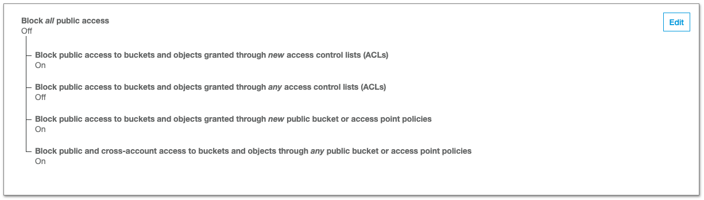

# AWS S3 Demo with MERN

## Set Up
#### Packages to install in your backend
- multer
- aws-sdk

#### Create your AWS Bucket
Navigate to [https://s3.console.aws.amazon.com/s3/home?region=us-east-1](https://s3.console.aws.amazon.com/s3/home?region=us-east-1) click on “create bucket”, enter a name, choose a region, and leave all other options as default.

## Set up AWS S3 in your backend
### [`awsS3.js`](https://github.com/ssoonmi/aws-s3-MERN-demo/blob/master/awsS3.js)
Make a file called `awsS3.js` at the root of your project. [Link to file](https://github.com/ssoonmi/aws-s3-MERN-demo/blob/master/awsS3.js)
In there, you will use the package, `aws-sdk`, set up your credentials for aws, and then export it.

```javascript
const AWS = require("aws-sdk");
if (process.env.NODE_ENV !== "production") {
  AWS.config.loadFromPath("./credentials.json");
}
const s3 = new AWS.S3({ apiVersion: "2006-03-01" });

module.exports = { s3 };
```
#### `AWS.config.loadFromPath`
This function is allowing us to configure our aws keys using a json file. 
> You can learn more about how this works here:
> [https://docs.aws.amazon.com/sdk-for-javascript/v2/developer-guide/loading-node-credentials-json-file.html](https://docs.aws.amazon.com/sdk-for-javascript/v2/developer-guide/loading-node-credentials-json-file.html)

#### How to set up your credentials in production
You do not need a credentials.json in production. Instead, all you need to do is set environmental keys for `AWS_ACCESS_KEY_ID` and `AWS_SECRET_ACCESS_KEY`.

> You can read more about how AWS uses the environment variables here:
> [https://docs.aws.amazon.com/sdk-for-javascript/v2/developer-guide/loading-node-credentials-environment.html](https://docs.aws.amazon.com/sdk-for-javascript/v2/developer-guide/loading-node-credentials-environment.html)

### `credentials.json`
> [How to Get Your Access Keys](https://help.bittitan.com/hc/en-us/articles/115008255268-How-do-I-find-my-AWS-Access-Key-and-Secret-Access-Key-)

Make a file called `credentials.json` **at the root** of your project.
In there, you will set your aws credentials.
```json
{
  "accessKeyId": "<Your AWS Access Key ID>",
  "secretAccessKey": "<Your AWS Secret Access Key>",
  "region": "us-east-1"
}
```
**MAKE SURE TO GITIGNORE THIS FILE**

## Private vs Public File Uploading
If you absolutely don't want your file images to be publicly available by just any user, you want your files to be private. If you don't care if users are able to access those files (e.g. on Twitter, posts are public so any photos with those posts can be publicly viewed), then you can set up the files to be publicly read.

Take a look at the following file, [`awsS3.js`](https://github.com/ssoonmi/aws-s3-MERN-demo/blob/master/awsS3.js), to see how to set up private vs. public AWS S3 upload.

### Public Files
How to set up uploading and reading public files on the backend.

#### Public File Write Configuration
Take a look at the function `singlePublicFileUpload` in the following file, [`awsS3.js`](https://github.com/ssoonmi/aws-s3-MERN-demo/blob/master/awsS3.js). It accepts a single file which to upload to AWS S3.

```javascript
const singlePublicFileUpload = async (file) => {
  const { originalname, mimetype, buffer } = await file;
  const path = require("path");
  // name of the file in your S3 bucket will be the date in ms plus the extension name
  const Key = new Date().getTime().toString() + path.extname(originalname);
  const uploadParams = {
    Bucket: NAME_OF_BUCKET,
    Key,
    Body: buffer,
    ACL: "public-read"
  };
  const result = await s3.upload(uploadParams).promise();

  // save the name of the file in your bucket as the key in your database to retrieve for later
  return result.Location;
};
```

We will generate a key on S3 that we can use to identify the file that we will be uploading by using a timestamp which guarantees that they key will always be unique.

`const Key = new Date().getTime().toString() + path.extname(originalname);`

The upload parameters to S3 include a key-value pair, `ACL: "public-read"`. This tells the bucket that this file can be publicly read by anyone who has the link to the file. 

S3 sends back data on the saved file which is saved to the variable `result`. 

`const result = await s3.upload(uploadParams).promise();`

We will be saving this link that S3 generates for us to our Mongo database which can be extracted from `result.Location`

Now all we need is the file to pass into the `singlePublicFileUpload` function. We are going to be importing it to one of our routes [Users Routes](https://github.com/ssoonmi/aws-s3-MERN-demo/blob/master/routes/api/users.js).

In this file, we need to import the `singlePublicFileUpload` function as well as the `singleMulterUpload` middleware from the `awsS3.js` file.

```javascript
// POST api/users
router.post("/", singleMulterUpload("image"), async (req, res) => {
  const userData = req.body;
  userData.image = await singlePublicFileUpload(req.file);
  const user = new User(userData);
  await user.save();
  res.json(user);
});
```


```javascript
// in awsS3.js
const storage = multer.memoryStorage({
    destination: function(req, file, callback) {
        callback(null, '');
    }
});

const singleMulterUpload = (nameOfKey) => multer({ storage: storage }).single(nameOfKey);
```

`singleMulterUpload` is a function that generates the middleware necessary to convert the data from our form into readable fields and files. This function accepts the key to which we expect the files to be saved under in our data (`"image"` in this case).

We connect the `singleMulterUpload` middleware to our `POST /api/users` route, and then we can access the file in our request, `req` under the key of `file`.

Because the `singlePublicFileUpload` is an async function, it returns a promise. That promise returns the file URL that we want to save to our database. In this case, I want to save that url under the key of `image` on the new User. 

#### Public File Read Configuration

**On AWS S3 Console**

Access your bucket public permissions: 


Select the following permissions:


Hit Save

**Sending up the files to your frontend**

All you need to read the files on your frontend is the link to the file that you saved to the database. Nothing special is needed other than the saved S3 URL.

### Private Files Backend
How to set up uploading and reading private files in the backend.

#### Private File Write Configuration
Take a look at the function `singlePrivateFileUpload` in the following file, [`awsS3.js`](https://github.com/ssoonmi/aws-s3-MERN-demo/blob/master/awsS3.js). It accepts a single file which to upload to AWS S3.

```javascript
const singlePrivateFileUpload = async (file) => {
  const { originalname, mimetype, buffer } = await file;
  const path = require("path");
  // name of the file in your S3 bucket will be the date in ms plus the extension name
  const Key = new Date().getTime().toString() + path.extname(originalname);
  const uploadParams = {
    Bucket: NAME_OF_BUCKET,
    Key,
    Body: buffer
  };
  const result = await s3.upload(uploadParams).promise();

  // save the name of the file in your bucket as the key in your database to retrieve for later
  return result.Key;
};
```

We will generate a key on S3 that we can use to identify the file that we will be uploading by using a timestamp which guarantees that they key will always be unique.

`const Key = new Date().getTime().toString() + path.extname(originalname);`

S3 sends back data on the saved file which is saved to the variable `result`. 

`const result = await s3.upload(uploadParams).promise();`

We will be saving the key that we generated to our Mongo database which can be extracted from `result.Key` because we need this key and our AWS credentials to access this file from S3.

Now all we need is the file to pass into the `singlePublicFileUpload` function. We are going to be importing it to one of our routes [Users Routes](https://github.com/ssoonmi/aws-s3-MERN-demo/blob/master/routes/api/users.js).

In this file, we need to import the `singlePrivateFileUpload` function as well as the `singleMulterUpload` middleware from the `awsS3.js` file.

```javascript
// POST api/users
router.post("/", singleMulterUpload("image"), async (req, res) => {
  const userData = req.body;
  userData.image = await singlePrivateFileUpload(req.file);
  const user = new User(userData);
  await user.save();
  res.json(user);
});
```


```javascript
// in awsS3.js
const storage = multer.memoryStorage({
    destination: function(req, file, callback) {
        callback(null, '');
    }
});

const singleMulterUpload = (nameOfKey) => multer({ storage: storage }).single(nameOfKey);
```

`singleMulterUpload` is a function that generates the middleware necessary to convert the data from our form into readable fields and files. This function accepts the key to which we expect the files to be saved under in our data (`"image"` in this case).

We connect the `singleMulterUpload` middleware to our `POST /api/users` route, and then we can access the file in our request, `req` under the key of `file`.

Because the `singlePrivateFileUpload` is an async function, it returns a promise. That promise returns the key that we want to save to our database. In this case, I want to save it under the key of `image` on the new User. 

#### Private File Read Configuration
Sending up the files that have private access requires us to get a signed URL from AWS S3 that we can then send up to our frontend for our authenticated users to access.

Take a look at the function `retrievePrivateFile` in the following file, [`awsS3.js`](https://github.com/ssoonmi/aws-s3-MERN-demo/blob/master/awsS3.js). It accepts a key, which we saved to our database, and returns the signed file URL from AWS S3. 

```javascript
const retrievePrivateFile = (key) => {
  let fileUrl;
  if (key) {
    fileUrl = s3.getSignedUrl("getObject", {
      Bucket: NAME_OF_BUCKET,
      Key: key
    });
  }
  return fileUrl || key;
};
```

Every time we want to fetch this file, we need a signed URL to access it. 

For example, in this case, when we want to fetch the images saved to each user, we need to map through all the users to make sure we get a signed URL for each user's image.

```javascript
// GET api/users
router.get("/", async (req, res) => {
  let users = await User.find({});
  // if single image is private file:
  users = users.map(user => {
    user.image = retrievePrivateFile(user.image);
    return user;
  });
  res.json(users);
});
```

### Multiple Files Backend
Take a look at the `multiplePublicFileUpload`, `multiplePrivateFileUpload`, and `multipleMulterUpload` functions in the following file, [`awsS3.js`](https://github.com/ssoonmi/aws-s3-MERN-demo/blob/master/awsS3.js). These functions are used in the same way as the single file upload functions above.

## File Upload on the Frontend
We will be using axios for this example. To send files, we must label our request as a `"multipart/form-data"`. 

```javascript
const config = {
  headers: {
    "content-type": "multipart/form-data    
  }
};
```

In the (`user_actions.js`)[https://github.com/ssoonmi/aws-s3-MERN-demo/blob/master/frontend/src/actions/users_actions.js] file, we will be defining our `createUser` action which accepts an object of key value pairs and turns them into `FormData` entries to send with our request.

```javascript
// user_actions.js
import axios from "axios";

export const RECEIVE_USER = "RECEIVE_USER";

export const createUser = (user) => dispatch => {
  const { images, image, name, email } = user;
  const formData = new FormData();
  formData.append("name", name);
  formData.append("email", email);

  // for multiple files
  if (images && images.length !== 0) {
    for (var i = 0; i < images.length; i++) {
      formData.append("images", images[i]);
    }
  }

  // for single file
  if (image) formData.append("image", image);

  const config = {
    headers: {
      "content-type": "multipart/form-data"
    }
  };

  return axios.post("/api/users", formData, config)
    .then(res => {
      const user = res.data;
      return dispatch({ type: RECEIVE_USER, user });
    });
};
```

The form itself, should look just like a regular React form. Take a look at this form for an example: (UserForm)[https://github.com/ssoonmi/aws-s3-MERN-demo/blob/master/frontend/src/components/main/MainPage.js]

```javascript
// MainPage.js file
import React from "react";
import { connect } from 'react-redux';
import { fetchUsers, createUser } from '../../actions/users_actions';

class MainPage extends React.Component {
  constructor(props) {
    super(props);
    this.state = {
      name: '',
      email: '',
      image: null,
      images: []
    };
    this.handleSubmit = this.handleSubmit.bind(this);
    this.updateFile = this.updateFile.bind(this);
    this.updateFiles = this.updateFiles.bind(this);
  }

  componentDidMount() {
    this.props.fetchUsers();
  }

  update(field) {
    return e => this.setState({ [field]: e.target.value });
  }

  handleSubmit(e) {
    e.preventDefault();
    this.props.createUser(this.state)
      .then(() => {
        this.setState({
          name: "",
          email: "",
          image: null,
          images: []
        });
      });
  }

  updateFiles(e){
    const { target: 
      {
        validity,
        files
      }
    } = e;
    return validity.valid && this.setState({ images: files });
  }

  updateFile(e){
    const { target: 
      {
        validity,
        files: [file]
      }
    } = e;
    return validity.valid && this.setState({ image: file });
  }

  render() {
    return (
      <div>
        <h1>AWS S3 Express-React Demo</h1>
        <form onSubmit={this.handleSubmit}>
          <label>
            <input 
              type="text" 
              placeholder="Name" 
              value={this.state.name} 
              onChange={this.update("name")} />
          </label>
          <label>
            <input 
              type="email" 
              placeholder="Email"
              value={this.state.email} 
              onChange={this.update("email")} />
          </label>
          <label>
            Single Upload
            <input 
              type="file"
              onChange={this.updateFile} />
          </label>
          {/* <label>
            Multiple Upload
            <input 
              type="file"
              multiple
              onChange={this.updateFiles} />
          </label> */}
          <input type="submit" value="Create User" />
        </form>
        <ul>
          {this.props.users.map(user => (
            <li key={user._id}>
              <div>{user.name}</div>
              <div>{user.email}</div>
              
            </li>
          ))}
        </ul>
      </div>
    );
  }
}

const msp = state => {
  return {
    users: Object.values(state.users)
  };
};

const mdp = dispatch => {
  return {
    createUser: (user) => dispatch(createUser(user)),
    fetchUsers: () => dispatch(fetchUsers())
  };
};

export default connect(msp, mdp)(MainPage);
```


If you have any questions or get stuck on any part of the process, please feel free to message me. 
